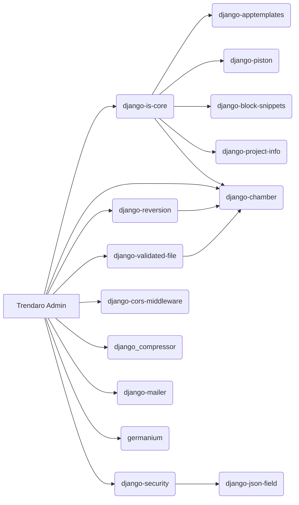

# trendaro-dead-pendencies
A monorepo with all obscure packages surrounding the `matl-is-core`.

GitHub's `Releases` host packages for `pip install`.

As many of the packages are depending on eg `django-chamber`, update to one
usually means releasing all, otherwise pip calls out dependency mismatch.

# create a new release
It is necessary to update more than just a single package, because they refer
to each other in their `setup.py` files.

```bash
TAG=v1.2
DIR=release/$TAG
MESSAGE="Deferred fields in django-chamber"

rm -rf $DIR
mkdir -p $DIR

# find all references to update
grep -r --include setup.py dead
# TODO: update paths in the setup.py files

# find all directories looking like packages
find . -maxdepth 2 -name 'setup.py' | xargs -I{} bash make-tar.sh "{}" "$DIR"

# check if all is commited!
git status
git commit ...

git tag -am $MESSAGE $TAG

# push the tags to remote
git push

# create a release from the pushed tag and upload all files
gh release create -t "$MESSAGE" --notes '' "$TAG" $DIR/*
```

# Dependency graph
Use [Mermaid live](https://mermaid.live/) to test.


